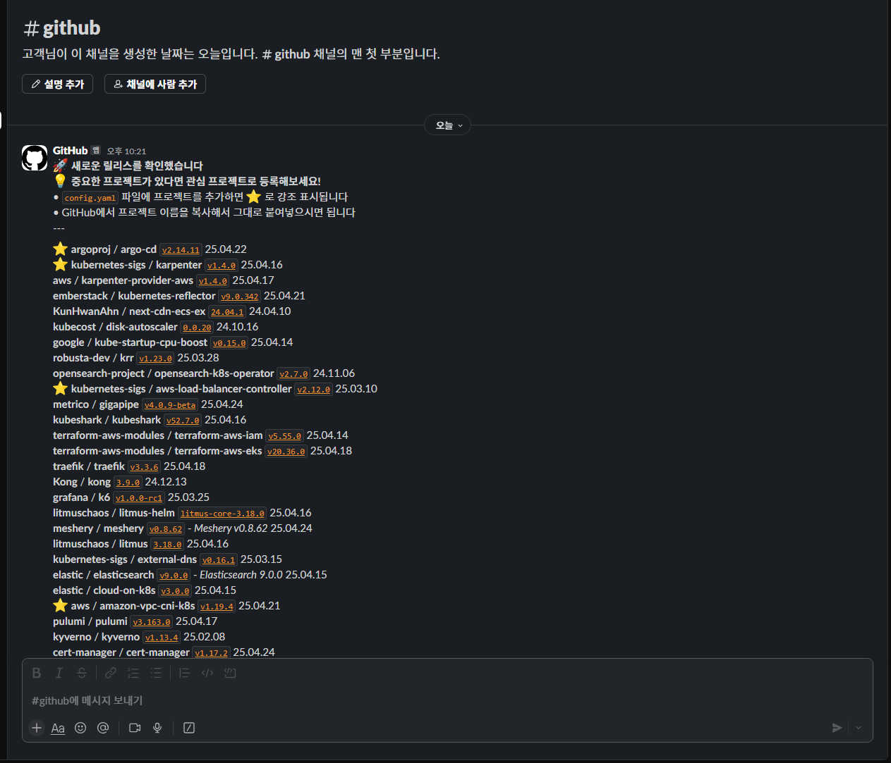

# 🌟 GitHub Stars 릴리스 알림

<div align="center">

[](https://github.com/dongdorrong/github-stars-notification/actions)
[](https://github.com/dongdorrong/github-stars-notification)

GitHub에서 스타를 준 저장소의 새로운 릴리스를 자동으로 감지하여 <br>
Slack으로 알림을 보내주는 GitHub Actions 워크플로우입니다. ✨

</div>

## 🎯 기능

- 🔍 GitHub 스타 저장소의 최신 릴리스 자동 감지
- ⏰ 하루 2회 (오전 9시, 오후 6시) 자동 체크
- 💬 Slack을 통한 새로운 릴리스 알림
- 💾 릴리스 정보 캐싱으로 중복 알림 방지
- ⭐ 관심 프로젝트 강조 표시
- ❗ 버전 변경 감지 및 하이라이트
- 🛡️ 자동 보안 취약점 검사

<div align="center">



</div>

## 🔒 보안 취약점 검사

워크플로우는 실행될 때마다 자동으로 GitHub Actions 모듈의 보안 취약점 검사를 수행합니다:

- 🔍 사용되는 모든 GitHub Actions 모듈의 알려진 보안 취약점 검사
  - actions/checkout@v4
  - actions/setup-python@v5
  - slackapi/slack-github-action@v1
  - 기타 워크플로우에서 사용되는 모든 액션
- 🚫 중간 수준(moderate) 이상의 취약점이 발견되면 워크플로우가 자동으로 중단됨
- 🔄 매일 2회 정기적인 보안 검사 수행
- 🚨 취약점 발견 시 워크플로우 실행 로그에서 상세 정보 확인 가능

이를 통해 항상 안전한 버전의 GitHub Actions 모듈만을 사용하여 워크플로우가 실행됩니다.

## ⚙️ 설정 방법

### 1️⃣ GitHub Personal Access Token (PAT) 생성
```bash
✓ repo:read 권한 필요
✓ Repository Secrets에 GH_PAT로 저장
```

### 2️⃣ Slack Webhook URL 설정
```bash
✓ Slack App에서 Incoming Webhook 생성
✓ Repository Secrets에 SLACK_WEBHOOK로 저장
```

### 3️⃣ 관심 프로젝트 설정 (선택사항)
특별히 관심있는 프로젝트는 `config.yaml` 파일에 추가할 수 있습니다:
```yaml
# 특별히 관심있는 프로젝트 목록
special_projects:
  - "kubernetes / kubernetes"
  - "elastic / elasticsearch"
  - "grafana / grafana"
```
GitHub에서 프로젝트 이름을 복사해서 그대로 붙여넣으면 됩니다.

## 📬 알림 형식

새로운 릴리스가 감지되면 다음과 같은 형식으로 Slack 메시지가 전송됩니다:

### 메시지 구성
1. 헤더
   ```
   🚀 새로운 릴리스를 확인했습니다
   ```

2. 버전 변경 경고 (버전 변경이 있는 경우)
   ```
   [빨간색 박스]
   ❗ 버전 변경이 포함된 릴리스가 있습니다. 반드시 확인해주세요!
   ```

3. 프로젝트 목록
   ```
   [일반 프로젝트]
   organization / repository v1.2.3 - Release Name 25.04.16

   [관심 프로젝트]
   ⭐ organization / repository v1.2.3 - Release Name 25.04.16

   [버전 변경이 있는 프로젝트]
   ❗ organization / repository v1.2.3 → v1.2.4 - Release Name 25.04.16

   [버전 변경이 있는 관심 프로젝트]
   ❗ ⭐ organization / repository v1.2.3 → v1.2.4 - Release Name 25.04.16
   ```

### 표시 항목
- 저장소 이름 (`organization / repository` 형식)
- 릴리스 태그 (클릭 가능한 링크)
  - 버전 변경이 있는 경우 `이전버전 → 새버전` 형식으로 표시
- 릴리스 이름 (태그와 다른 경우)
- 발행 날짜 (YY.MM.DD)

### 특별 표시
- ⭐ : 관심 프로젝트 (config.yaml에 등록된 프로젝트)
- ❗ : 버전 변경이 있는 프로젝트
- 빨간색 박스 : 버전 변경 경고 메시지

## 🚀 수동 실행

워크플로우는 GitHub Actions 탭에서 `Run workflow` 버튼을 통해 수동으로도 실행할 수 있습니다.

---

<div align="center">
Made with ❤️ by <a href="https://github.com/dongdorrong">dongdorrong</a>
</div> 