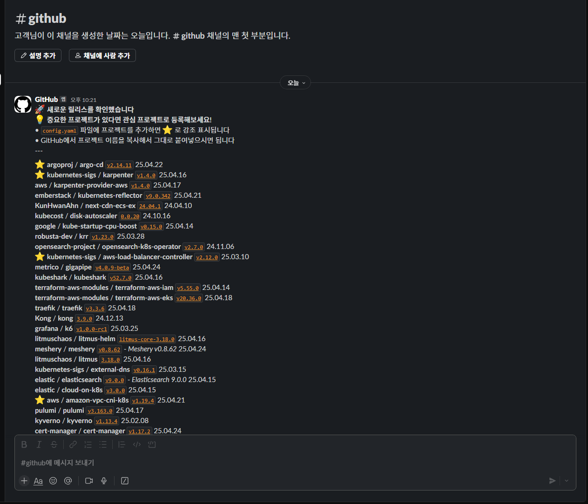

# 🌟 GitHub Stars 릴리스 알림

<div align="center">

[](https://github.com/dongdorrong/github-stars-notification/actions)
[](https://github.com/dongdorrong/github-stars-notification)

GitHub에서 스타를 준 저장소의 새로운 릴리스를 감지하고, <br>
정책에 맞는 경우 Slack으로 알려주는 GitHub Actions 자동화입니다. ✨

</div>

## 🤖 AI/OMX 세션 컨텍스트

다른 OMX/Codex 세션에서 이 저장소를 작업할 때는 아래 문서를 먼저 읽습니다.

- Repo-local agent guidance: [`AGENTS.md`](AGENTS.md)
- Project handoff/context: [`docs/AI_PROJECT_CONTEXT.md`](docs/AI_PROJECT_CONTEXT.md)
- Kubernetes Intelligence 목표 아키텍처: [`docs/KUBERNETES_INTELLIGENCE_ARCHITECTURE.md`](docs/KUBERNETES_INTELLIGENCE_ARCHITECTURE.md)
- 단계별 구현 로드맵: [`docs/KUBERNETES_INTELLIGENCE_ROADMAP.md`](docs/KUBERNETES_INTELLIGENCE_ROADMAP.md)
- 결정적 상태·AI 경계 ADR: [`docs/adr/0001-deterministic-event-state-and-ai-boundary.md`](docs/adr/0001-deterministic-event-state-and-ai-boundary.md)
- Codex P0 UltraGoal: [`docs/CODEX_ULTRAGOAL_KUBERNETES_INTELLIGENCE.md`](docs/CODEX_ULTRAGOAL_KUBERNETES_INTELLIGENCE.md)
- GitHub MCP + 로컬 LLM 연동 설계: [`docs/GITHUB_MCP_LOCAL_LLM.md`](docs/GITHUB_MCP_LOCAL_LLM.md)
- 보안 레이어 후속 조치: [`docs/SECURITY_LAYERING_NOTES.md`](docs/SECURITY_LAYERING_NOTES.md)
- RAG/Knowledge Store 전환 TODO: [`docs/rag-todo.md`](docs/rag-todo.md)

## 🧭 Kubernetes Ecosystem Intelligence 확장 계획

현재 구현은 starred repository의 latest Release 감지와 Slack 알림에 집중합니다. 다음 단계에서는 Kubernetes/Cloud Native 생태계의 공식 Release, GitHub Security Advisory, Maintainer Announcement를 수집하고, 결정적 정책과 선택적 로컬 LLM 분석을 거쳐 Critical/High/Digest로 전달하는 구조로 확장합니다.

```text
Starred repositories
  -> Kubernetes ecosystem classification
  -> Releases / GHSA / official announcements
  -> durable event store + notification outbox
  -> deterministic priority policy
  -> local LLM/Codex advisory analysis
  -> Critical / High / Digest Slack delivery
```

핵심 원칙:

- 원본 이벤트, notification state, AI 분석 결과를 분리합니다.
- LLM은 신규/중복 판정, 상태 변경, Slack 전송 여부를 결정하지 않습니다.
- Slack 성공 전에는 이벤트를 delivered 처리하지 않습니다.
- 수동 preview 실행은 운영 상태를 소비하지 않습니다.
- private/internal repository 정보는 public artifact와 Knowledge export에서 기본 제외합니다.

GitHub 백로그:

- Epic: [#3 Kubernetes ecosystem official intelligence watcher](https://github.com/dongdorrong/github-stars-notification/issues/3)
- P0: [#4 event/outbox](https://github.com/dongdorrong/github-stars-notification/issues/4), [#5 incremental releases](https://github.com/dongdorrong/github-stars-notification/issues/5), [#6 state-safe preview/workflow](https://github.com/dongdorrong/github-stars-notification/issues/6)
- P1: [#7 project registry](https://github.com/dongdorrong/github-stars-notification/issues/7), [#8 GHSA](https://github.com/dongdorrong/github-stars-notification/issues/8), [#9 local LLM](https://github.com/dongdorrong/github-stars-notification/issues/9), [#10 Slack routing](https://github.com/dongdorrong/github-stars-notification/issues/10)
- P2: [#11 maintainer announcements](https://github.com/dongdorrong/github-stars-notification/issues/11), [#12 visibility/Knowledge/CI](https://github.com/dongdorrong/github-stars-notification/issues/12)

> 이 절은 목표 설계와 백로그를 설명합니다. 현재 운영 동작은 아래 문서와 코드에 기술된 latest Release/cache 기반 구현입니다.

## 🎯 기능

- 🔍 GitHub 스타 저장소의 최신 릴리스 자동 감지
- 📦 전체 starred repository 메타데이터를 `.cache/stars-inventory.json`으로 생성하고 `starred-inventory` artifact로 보관
- ⏰ 하루 3번 자동 체크: 한국시간 08시, 14시, 17시 (UTC `23:00`, `05:00`, `08:00`)
- 💾 `.cache/releases.json` 기반 중복 알림 방지
- 💬 Slack Incoming Webhook 알림
- ⭐ 관심 프로젝트 강조 및 즉시 알림 정책
- 🧾 다른 앱/로컬 LLM이 읽을 수 있는 `.cache/release-feed.json` 생성
- 🧪 token 없이 fixture로 로컬 테스트 가능

<div align="center">



</div>

## ⚙️ 설정 방법

### 1️⃣ GitHub Personal Access Token (PAT) 생성

```bash
# Repository Secrets에 GH_PAT로 저장
# starred repo와 release 조회가 가능한 읽기 권한을 사용
```

### 2️⃣ Slack Webhook URL 설정

```bash
# Slack 워크스페이스에서 Incoming Webhook 생성
# Repository Secrets에 SLACK_WEBHOOK_URL로 저장
```

### 3️⃣ 관심 프로젝트와 알림 정책 설정

`config.yaml`에서 관심 프로젝트와 정책을 관리합니다.

```yaml
special_projects:
  - "kubernetes / kubernetes"
  - "grafana/grafana"

notification:
  min_release_count: 5
  special_project_always_notify: true
  first_run_notify: true
  max_slack_text_length: 35000

feed:
  output_path: ".cache/release-feed.json"

llm:
  enabled: false
  provider: "local"
  role: "summarize_and_prioritize_only"
```

정책 의미:

| 설정 | 의미 |
| --- | --- |
| `min_release_count` | 일반 릴리스가 이 개수 이상 모이면 Slack 알림 |
| `special_project_always_notify` | 관심 프로젝트 릴리스는 임계값 미만이어도 알림 |
| `first_run_notify` | 캐시가 없는 첫 실행에서 현재 릴리스 목록을 알림으로 보낼지 여부 |
| `feed.output_path` | 앱/로컬 LLM 연동용 deterministic JSON feed 경로 |

## 📬 알림 형식

새로운 릴리스가 정책을 만족하면 Slack 메시지가 전송됩니다.

```text
🚀 새로운 릴리스 5개를 확인했습니다

💡 중요한 프로젝트가 있다면 관심 프로젝트로 등록해보세요!
• config.yaml의 special_projects에 등록하면 ⭐ 로 강조됩니다
• notification 정책으로 임계값과 첫 실행 동작을 조정할 수 있습니다

---

⭐ *grafana* / *grafana* <release-url|`v12.0.0`> - 26.06.20
*kubernetes* / *kubernetes* <release-url|`v1.34.0`> - 26.06.20
```

표시 항목:

- 저장소 이름 (`*organization* / *repository*`)
- 릴리스 태그 링크
- 릴리스 이름(태그와 다를 때만)
- 발행 날짜 (`YY.MM.DD`)
- 관심 프로젝트 `⭐`

## 🧾 Release feed / 로컬 LLM 연동

`check_release.py`는 Slack 전송 여부와 무관하게 `.cache/release-feed.json`을 생성합니다. 이 파일은 다른 로컬 앱이나 로컬 LLM이 읽는 안전한 연결 지점입니다.

원칙:

- Python이 새 릴리스/중복/알림 여부를 결정합니다.
- 로컬 LLM은 요약, 분류, 중요도 초안만 작성합니다.
- GitHub MCP를 붙이더라도 읽기 전용 수집면으로 사용합니다.

자세한 설계는 [`docs/GITHUB_MCP_LOCAL_LLM.md`](docs/GITHUB_MCP_LOCAL_LLM.md)를 봅니다.

### fordongdorrong Knowledge export

생성된 `.cache/release-feed.json`을 GitHub API 재호출이나 Slack 전송 없이 중앙 Knowledge Store 계약(JSONL)으로 내보냅니다.

```bash
./scripts/export_knowledge_jsonl.py \
  --feed .cache/release-feed.json \
  --output /tmp/github-stars.knowledge.jsonl
```

산출물은 `fordongdorrong`의 `fordong knowledge validate-export` / `import --dry-run`으로 검증합니다.

## 🚀 실행

### GitHub Actions

워크플로우는 schedule 또는 Actions 탭의 `Run workflow`로 실행됩니다. 수동 실행은 기본적으로 Slack 전송을 억제하며, 실제 알림까지 보내려면 `send_slack=true`를 선택합니다.

매 실행마다 `starred-inventory` artifact에 다음 파일을 남깁니다.

- `repos.txt`: `owner/repo` 전체 목록
- `.cache/stars-inventory.json`: description/topics/language/update 시각 등 분류용 메타데이터

### 로컬 fixture 테스트

실제 GitHub token 없이 동작을 확인할 수 있습니다.

```bash
cat > /tmp/repos.txt <<'EOF'
grafana / grafana
other/repo
EOF

cat > /tmp/releases.json <<'EOF'
{
  "grafana/grafana": {
    "tag_name": "v12.0.0",
    "name": "Release v12.0.0",
    "published_at": "2026-06-20 10:00:00",
    "html_url": "https://github.com/grafana/grafana/releases/tag/v12.0.0"
  }
}
EOF

python3 .github/scripts/check_release.py \
  --repos-file /tmp/repos.txt \
  --fixture-releases /tmp/releases.json \
  --cache-path /tmp/releases-cache.json \
  --feed-path /tmp/release-feed.json \
  --github-output /tmp/github-output.txt \
  --no-sleep
```

### 실제 로컬 실행

```bash
export GH_TOKEN=...
export GITHUB_OUTPUT=/tmp/github-output.txt

mkdir -p .cache

gh api /user/starred --paginate \
  --jq '.[] | {full_name, description, html_url, language, topics, archived, disabled, fork, pushed_at, updated_at, stargazers_count, open_issues_count}' \
  > .cache/stars-inventory.jsonl
jq -s 'sort_by(.full_name)' .cache/stars-inventory.jsonl > .cache/stars-inventory.json
jq -r '.[].full_name' .cache/stars-inventory.json > repos.txt

python3 .github/scripts/check_release.py
```

토큰과 webhook은 shell history, `.env`, Git 커밋에 남기지 않습니다.

## ✅ 검증

```bash
python3 -m py_compile .github/scripts/check_release.py
python3 -m unittest discover -s tests -v
```

---

<div align="center">
Made with ❤️ by <a href="https://github.com/dongdorrong">dongdorrong</a>
</div>
